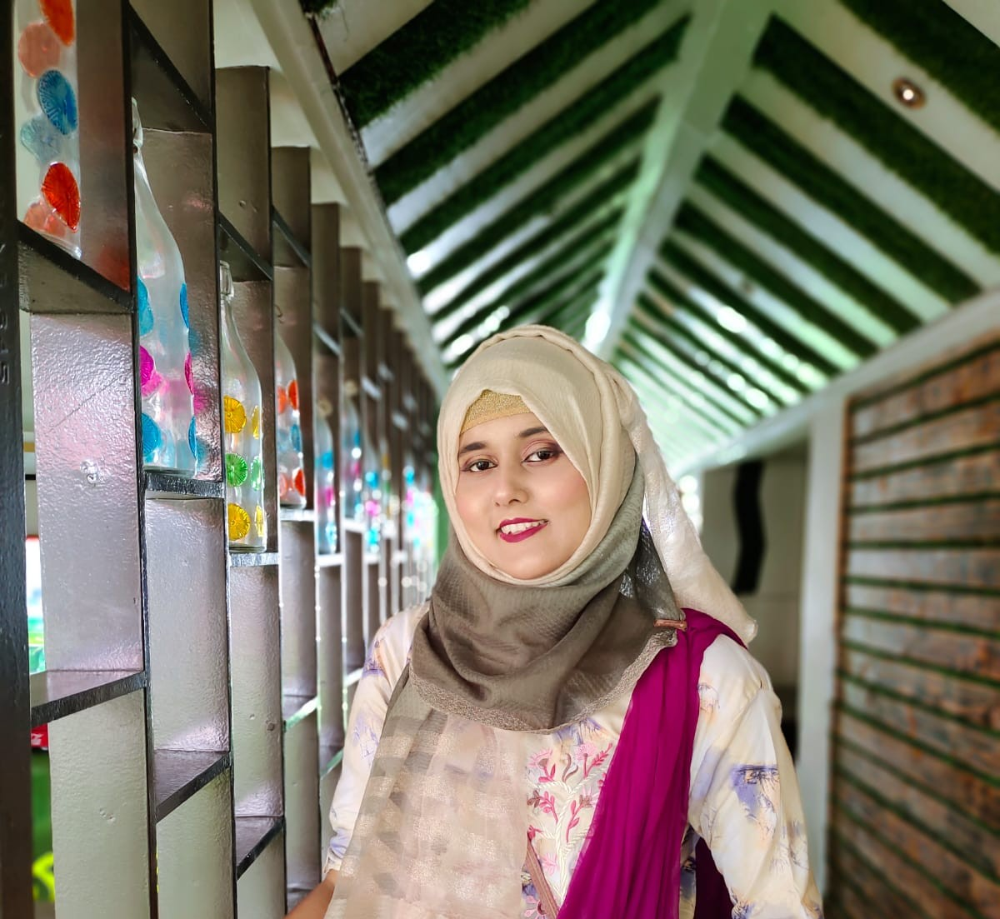
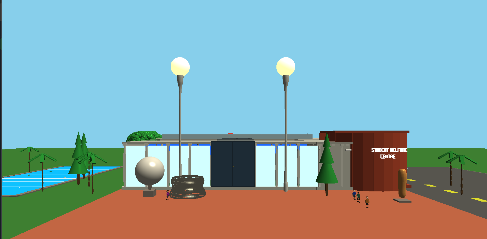

# Dynamic Portfolio

This is my personal dynamic portfolio website. I developed this project to present my profile, skills, education, projects, resume, and contact information in a professional way.

## Project Overview


This portfolio is a PHP and MySQL based dynamic website. The website content is stored in a MySQL database and displayed dynamically using PHP. It includes a home section, skills section, project showcase, education timeline, contact section, resume download option, and admin login system.

## About Me

I am **Sanzida Moin Tithi**, a final-year Computer Science and Engineering student at Khulna University of Engineering & Technology. I am interested in software engineering, backend development, problem solving, desktop application development, computer vision, and computer graphics.

## Technologies Used

* PHP
* MySQL
* HTML
* CSS
* JavaScript
* Bootstrap
* XAMPP
* phpMyAdmin

## Features

* Dynamic home section with profile image and introduction
* Skills and focus area section
* Learn More popup for detailed skill descriptions
* Project showcase with images, descriptions, technology tags, and GitHub links
* Education timeline
* Contact form section
* Resume download option
* Admin login system
* MySQL database integration
* Responsive portfolio layout
* Clean dark UI design with cyan highlight color

## Project Preview

### Profile Image



### Project Images

#### LaravelProject-Foodie


#### Bank Management System


#### Colorful Fruit Detection and Counting System


#### SWC 3D Interactive Visualization



## Main Sections

### Home Section

The home section contains my name, role, short introduction, social media links, resume download button, and profile image.

### Skills Section

The skills section displays my main focus areas. Each skill card has a **Learn More** button. When the button is clicked, detailed information appears in a popup.

Focus areas:

* Software Engineering
* Backend & Database Development
* Problem Solving & Competitive Programming
* Computer Vision & Image Processing
* Computer Graphics & Interactive Visualization
* Desktop Application Development
* Tools, Git & Collaboration
* Web Development & Responsive UI

### Projects Section

The projects section displays my major academic and personal projects with images, short descriptions, technology tags, and GitHub links.

Projects included:

* LaravelProject-Foodie
* Dynamic Portfolio
* Colorful Fruit Detection and Counting System
* Bank Management System
* SWC 3D Interactive Visualization

### Education Section

The education section displays my academic background in timeline format.

### Contact Section

The contact section allows visitors to send messages through a contact form.

### Admin Panel

The admin panel is used to access the portfolio management area. It includes admin authentication and logout functionality.

## Database Setup

Database name:

```sql
tithi
```

Import the included SQL file into phpMyAdmin:

```text
portfolio database.sql
```

The database contains tables for:

* Admin login
* Navbar items
* Home section
* Skills section
* Projects section
* Education section
* Social icons
* Footer links
* Contact messages

## How to Run Locally

1. Install XAMPP.
2. Start **Apache** and **MySQL** from XAMPP Control Panel.
3. Copy the project folder into:

```text
C:\xampp\htdocs\
```

4. Open phpMyAdmin:

```text
http://localhost/phpmyadmin
```

5. Create a database named:

```text
tithi
```

6. Import the SQL file:

```text
portfolio database.sql
```

7. Run the project in browser:

```text
http://localhost/DynamicPortfolio/
```

## Admin Login

Admin login page:

```text
http://localhost/DynamicPortfolio/admin_login.php
```

Default login:

```text
Username: admin
Password: admin123
```

## Folder Structure

```text
DynamicPortfolio/
│
├── index.php
├── style.css
├── script.js
├── admin.css
├── db_connection.php
├── admin_login.php
├── admin_authenticate.php
├── admin_dashboard.php
├── admin_logout.php
├── portfolio database.sql
├── Sanzida_Moin_Tithi_Resume.pdf
├── profile.jpeg
├── 7.webp
├── bank.jpeg
├── OIP.webp
├── OIP (1).webp
├── pic_front_exterior.png
└── README.md
```

## What I Implemented

* Designed and developed a dynamic portfolio website
* Connected the website with a MySQL database
* Loaded website content dynamically using PHP
* Added a professional home section with profile image
* Added skills section with Learn More popup
* Added project showcase with images, tags, descriptions, and GitHub buttons
* Added education timeline
* Added contact form section
* Added resume download option
* Added admin login and authentication system
* Improved UI design, spacing, colors, and readability
* Organized project-related images and assets
* Added database file for local setup
## Website Screenshots

### Home Section


### Skills Section
<


### Projects Section


### Education Section


### Contact Section


## Future Improvements

* Add full CRUD functionality in the admin dashboard
* Store and manage contact messages from the admin panel
* Add project filtering by technology
* Improve mobile responsiveness
* Deploy the portfolio online

##Author
#Sanzida Moin Tithi

